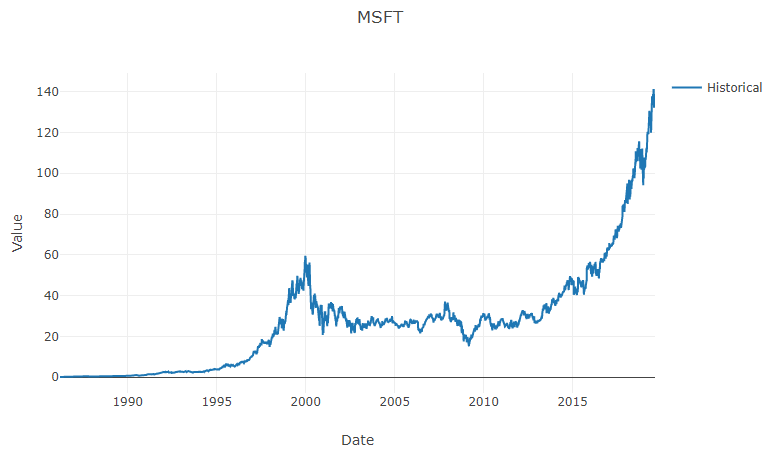

# Step 3: Display a Graph

We have stock market time-series data in memory now, but it'd be more useful if we could see it.

## Add a TimeSeriesAnalysis Class

Eventually, we're going to want to generate forecasts for our time series, so let's add a class to bundle the raw time-series data with the associated predictions.
Add a new **TimeSeriesAnalysis.cs** file with this class definition:

```csharp
namespace Anomalies
{
    internal class TimeSeriesAnalysis
    {
        public TimeSeries TimeSeries { get; }

        public TimeSeriesAnalysis(TimeSeries timeSeries)
        {
            TimeSeries = timeSeries;
        }
    }
}
```

## Add a ChartBuilder Class

We added the [XPlot.Plotly](https://fslab.org/XPlot/plotly.html) NuGet package back in [step 1](./Step1.md).
Let's put it to use now.
Add a new **ChartBuilder.cs** file with this class definition:

```csharp
using System;
using System.Collections.Generic;
using System.Linq;
using XPlot.Plotly;

namespace Anomalies
{
    internal static class ChartBuilder
    {
        public static PlotlyChart BuildChart(TimeSeriesAnalysis analysis)
        {
            IEnumerable<Graph.Trace> traces = BuildTraces(analysis);
            PlotlyChart chart = BuildPlotlyChart(analysis.TimeSeries.Name, traces);
            return chart;
        }

        private static IEnumerable<Graph.Trace> BuildTraces(TimeSeriesAnalysis analysis)
        {
            yield return BuildTrace("Historical", analysis.TimeSeries.Observations);
        }

        private static Graph.Trace BuildTrace(string name, IEnumerable<Observation> observations)
        {
            DateTime[] dates = observations.Select(s => s.Date).ToArray();
            float[] values = observations.Select(s => s.Value).ToArray();

            return new Graph.Scatter()
            {
                name = name,
                x = dates,
                y = values
            };
        }

        private static PlotlyChart BuildPlotlyChart(string chartTitle, IEnumerable<Graph.Trace> traces)
        {
            PlotlyChart chart = Chart.Plot(traces);

            var layout = new Layout.Layout { title = chartTitle };
            chart.WithLayout(layout);
            chart.Width = 800;
            chart.Height = 500;
            chart.WithXTitle("Date");
            chart.WithYTitle("Value");
            chart.WithLegend(true);

            return chart;
        }
    }
}
```

## Generate Time-Series Analysis

Now we're ready to pull things together back in the main `Program` class.
First, let's add an `Analyze` method to create a `TimeSeriesAnalysis` for each `TimeSeries`.

```csharp
private static IEnumerable<TimeSeriesAnalysis> Analyze(IEnumerable<TimeSeries> timeSeriesList)
{
    foreach (TimeSeries timeSeries in timeSeriesList)
    {
        var analysis = new TimeSeriesAnalysis(timeSeries);
        yield return analysis;
    }
}
```

This will require a new `using` statement at the top of the file.

```csharp
using System.Collections.Generic;
```

## Show Charts

Next, we need another method in the `Program` class to build and display all our charts.

```csharp
private static void ShowCharts(IEnumerable<TimeSeriesAnalysis> analysisResults)
{
    var charts = new List<PlotlyChart>();

    foreach (TimeSeriesAnalysis analysis in analysisResults)
    {
        PlotlyChart chart = ChartBuilder.BuildChart(analysis);
        charts.Add(chart);
    }

    Chart.ShowAll(charts);
}
```

This will require another new `using` statement at the top of the file.

```csharp
using XPlot.Plotly;
```

## Pull It All Together

It's the moment of truth.
Update the `Main` method to call our new helper methods.

```csharp
static void Main(string[] args)
{
    TimeSeries[] stockSeries = StockLoader.Load();
    IEnumerable<TimeSeriesAnalysis> analysisResults = Analyze(stockSeries);
    ShowCharts(analysisResults);
    Console.WriteLine("Finished!");
}
```

## Test

Let's build and run to see if everything worked.
The call to `Chart.ShowAll()` should launch your default web browser to view an HTML file **XPlot.Plotly** wrote to a temp folder.



## Next

Go to [Step 4: Forecast With Linear Regression](./Step4.md).
