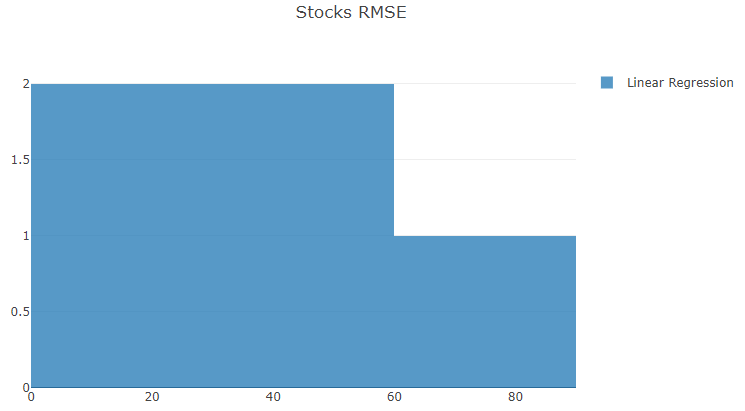

# Step 6: Evaluation

Before we see what ML.NET has to offer for time series forecasting, let's think about how to evaluate the quality of a forecast.
ML.NET has some built-in functions to help with this.

## Add Forecast Scoring

Add a new **ForecastScorer.cs** file with this class definition:

```csharp
using System.Collections.Generic;
using Microsoft.ML;
using Microsoft.ML.Data;

namespace Anomalies
{
    internal static class ForecastScorer
    {
        public static RegressionMetrics Evaluate(Observation[] actual, Observation[] forecast)
        {
            IEnumerable<Comparison> comparisons = BuildComparisons(actual, forecast);

            var context = new MLContext();
            IDataView predictions = context.Data.LoadFromEnumerable(comparisons);

            RegressionMetrics regressionMetrics = context.Regression.Evaluate(
                data: predictions,
                labelColumnName: nameof(Comparison.Actual),
                scoreColumnName: nameof(Comparison.Predicted));

            return regressionMetrics;
        }

        private static IEnumerable<Comparison> BuildComparisons(Observation[] actual, Observation[] forecast)
        {
            for (int i = 0; i < actual.Length; i++)
            {
                var comparison = new Comparison
                {
                    Actual = actual[i].Value,
                    Predicted = forecast[i].Value
                };

                yield return comparison;
            }
        }

        private class Comparison
        {
            public float Actual { get; set; }
            public float Predicted { get; set; }
        }
    }
}
```

This utility will return a `RegressionMetrics` object with several measures of the quality of the forecast's fit.

## Associate Metrics With Forecasts

We want to keep these metrics with the forecast information.
Update the `ForecastDetails` class by adding a new `RegressionMetrics` property.

```csharp
public RegressionMetrics RegressionMetrics { get; }
```

This requires a new `using` statement.

```csharp
using Microsoft.ML.Data;
```

Initialize this property from in the constructor:

```csharp
public ForecastDetails(
    string algorithmName,
    IEnumerable<Observation> forecast,
    RegressionMetrics regressionMetrics)
{
    AlgorithmName = algorithmName;
    Forecast = forecast.ToArray();
    RegressionMetrics = regressionMetrics;
}
```

## Invoke Evaluation

Before it can compile, let's update the `Analyze` method in the `Program` class.
Revise the chunk of code in the `foreach` loop handling forecasting to look like this:

```csharp
var forecasts = new List<ForecastDetails>();
                Observation[] linearRegressionForecast = LinearRegressionForecaster
                    .Forecast(historical, horizon, timeSeries.Interval);
                RegressionMetrics linearRegressionMetrics = ForecastScorer.Evaluate(actual, linearRegressionForecast);
                forecasts.Add(new ForecastDetails("Linear Regression", linearRegressionForecast, linearRegressionMetrics));
```

This will require a new `using` statement.

```csharp
using Microsoft.ML.Data;
```

## Building a Histogram for Metrics

We could write those metrics out to the console for each time series, but it'd be nice to get a visualization.
Let's build a histogram of the root-mean-square error (RMSE) for each forecast.

Add a new **HistogramBuilder.cs** file with this class definition:

```csharp
using System.Collections.Generic;
using System.Linq;
using XPlot.Plotly;

namespace Anomalies
{
    internal static class HistogramBuilder
    {
        public static PlotlyChart BuildHistogram(string groupName, ICollection<TimeSeriesAnalysis> analysisResults)
        {
            IEnumerable<Graph.Histogram> traces = BuildTraces(analysisResults);
            PlotlyChart chart = BuildChart(groupName, traces);
            return chart;
        }

        private static IEnumerable<Graph.Histogram> BuildTraces(ICollection<TimeSeriesAnalysis> analysisResults)
        {
            ILookup<string, ForecastDetails> forecastsByAlgorithm =
                analysisResults.SelectMany(a => a.Forecasts)
                .ToLookup(o => o.AlgorithmName);

            double max = analysisResults.Max(a => a.Forecasts.Max(f => f.RegressionMetrics.RootMeanSquaredError));
            int binSize = ((int)((max + 1) / 100)) * 10;

            foreach (IGrouping<string, ForecastDetails> forecastGrouping in forecastsByAlgorithm)
            {
                var trace = new Graph.Histogram
                {
                    name = forecastGrouping.Key,
                    x = forecastGrouping.Select(f => f.RegressionMetrics.RootMeanSquaredError),
                    opacity = 0.75,
                    autobinx = false,
                    xbins = new Graph.Xbins
                    {
                        start = 0,
                        end = binSize * 10,
                        size = binSize
                    }
                };

                yield return trace;
            }
        }

        private static PlotlyChart BuildChart(string groupName, IEnumerable<Graph.Histogram> traces)
        {
            PlotlyChart chart = Chart.Plot(traces);

            var layout = new Layout.Layout
            {
                title = $"{groupName} RMSE",
                barmode = "overlay"
            };

            chart.WithLayout(layout);
            chart.Width = 800;
            chart.Height = 500;
            chart.WithLegend(true);

            return chart;
        }
    }
}
```

This is ready to group results by algorithm once we have more forecasting algorithms in use.

## Add the Histogram to the Charts

Update the `ShowCharts` method in the `Program` class as follows to invoke the `HistogramBuilder`.

```csharp
private static void ShowCharts(TimeSeriesAnalysis[] analysisResults)
{
    var charts = new List<PlotlyChart>();

    foreach (TimeSeriesAnalysis analysis in analysisResults)
    {
        PlotlyChart chart = ChartBuilder.BuildChart(analysis);
        charts.Add(chart);
    }

    var histogram = HistogramBuilder.BuildHistogram("Stocks", analysisResults);
    charts.Add(histogram);

    Chart.ShowAll(charts);
}
```

To avoid multiple enumeration, the parameter was changed from `IEnumerable<TimeSeriesAnalysis>` to `TimeSeriesAnalysis[]`, so the `Main` method must be updated, too.

```csharp
TimeSeriesAnalysis[] analysisResults = Analyze(stockSeries).ToArray();
```

## Test the Histogram

Let's run the program to see our histogram.
We now have the root-mean-square error (RMSE) for the linear regression for several stocks.



## Next

Go to [Step 7: ML.NET Forecasting](./Step7.md).
