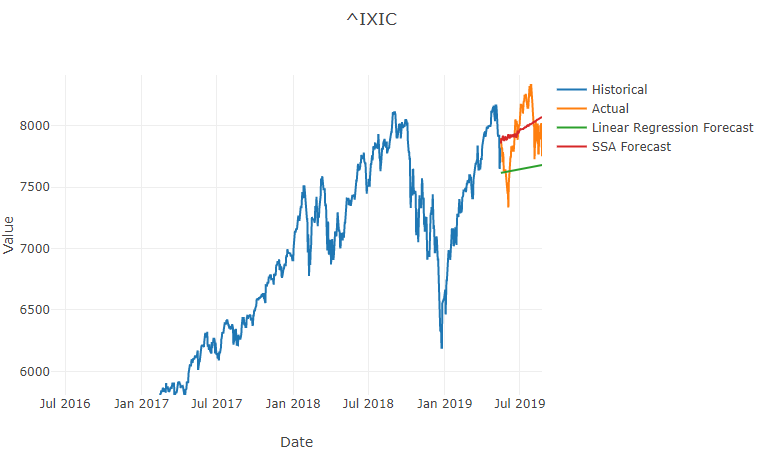
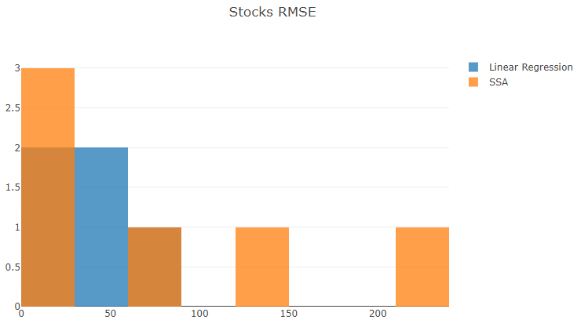

# Step 7: ML.NET Forecasting

We've written our own linear regression forecaster.
Let's see if ML.NET can help us.

## Add Singular Spectrum Analysis (SSA) Forecast

ML.NET includes a forecaster using a Singular Spectrum Analysis (SSA) model.
This technique is described in-depth in [Basic Singular Spectrum Analysis and Forecasting with R](https://arxiv.org/pdf/1206.6910.pdf).
SSA offers an advantage since it doesn’t require knowledge of the trend or periodicity of the data.
Let's create a new forecaster using this algorithm.

Add a new **SsaForecaster.cs** file with this class definition:

```csharp
using System;
using System.Collections.Generic;
using System.Linq;
using Microsoft.ML;
using Microsoft.ML.Transforms.TimeSeries;

namespace Anomalies
{
    internal class SsaForecaster
    {
        public static Observation[] Forecast(ICollection<Observation> observations, int horizon, TimeSpan interval)
        {
            // Create a new ML context.
            var ml = new MLContext();

            // Convert data to IDataView.
            IDataView dataView = ml.Data.LoadFromEnumerable(observations);

            // Setup arguments.
            var inputColumnName = nameof(Observation.Value);
            var outputColumnName = nameof(ForecastResult.Forecast);

            int windowSize = Math.Min(50, observations.Count / 2 - 1);
            int seriesLength = Math.Min(110, observations.Count);

            // Instantiate the forecasting model.
            var model = ml.Forecasting.ForecastBySsa(
                outputColumnName: outputColumnName,
                inputColumnName: inputColumnName,
                windowSize: windowSize,
                seriesLength: seriesLength,
                trainSize: observations.Count,
                horizon: horizon);

            // Train.
            var transformer = model.Fit(dataView);

            // Forecast the next set of values.
            using var forecastEngine = transformer.CreateTimeSeriesEngine<Observation, ForecastResult>(ml);
            var forecast = forecastEngine.Predict();

            var predictions = new List<Observation>();
            DateTime currentTime = observations.Last().Date;

            foreach (var predictedValue in forecast.Forecast)
            {
                currentTime = currentTime.Add(interval);
                predictions.Add(new Observation { Date = currentTime, Value = predictedValue });
            }

            return predictions.ToArray();
        }

        private class ForecastResult
        {
            public float[] Forecast { get; set; }
        }
    }
}
```

This class is similar to the `LinearRegressionForecaster`, but it leverages ML.NET.

## Invoke SSA Forecasting

Now we return to the `Analyze` method of the `Program` class and add the following code right after the linear regression forecasting.

```csharp
Observation[] ssaForecast = SsaForecaster.Forecast(historical, horizon, timeSeries.Interval);
RegressionMetrics ssaMetrics = ForecastScorer.Evaluate(actual, ssaForecast);
forecasts.Add(new ForecastDetails("SSA", ssaForecast, ssaMetrics));
```

This performs prediction with SSA, evaluates the regression metrics, and adds the forecasting results to be displayed.

## Test SSA

Run the application again.
You'll see each stock now includes two forecasts.
Zoom in to take a good look.
SSA seems to do a reasonable job fitting the data with the parameters we selected, but it's by no means perfect.



Scrolling down to the end to check the histogram, it looks like SSA sometimes performs very well, but can also perform much worse than a simple linear regression.
Smaller RMSE values (further left in the histogram bins) are better.



Maybe stocks are just too volatile to predict this way.
But what about other kinds of data with strong periodicity?

## Next

Go to [Step 8: New Time Series - Wait Times](./Step8.md).
