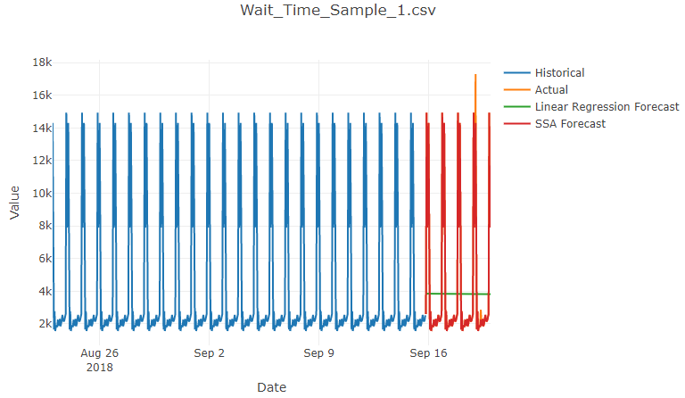
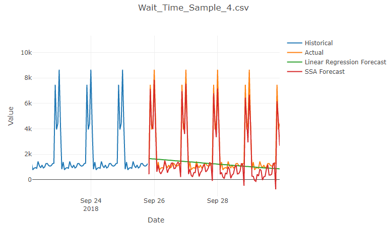
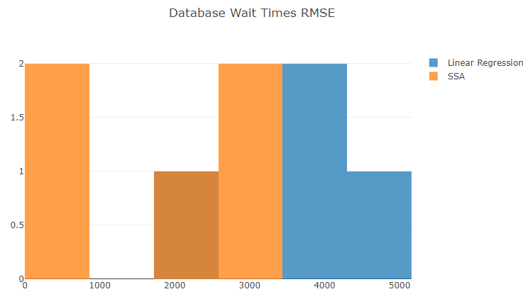

# Step 8: New Time Series – Wait Times

Singular Spectrum Analysis (SSA) didn't do a great job with stock market data.
Let's try it with time series with strong periodicity.
We'll use the data files we have with SQL Statement wait times from SolarWinds Database Performance Analyzer (DPA).

## Add Time Series Groups

We will need to distinguish which time series are stocks and which are database wait times.

Go back to the `TimeSeries` class and add a `Group` property.

```csharp
public string Group { get; }
```

Initialize the new property in the constructor.

```csharp
public TimeSeries(
    string name,
    IEnumerable<Observation> observations,
    TimeSpan interval,
    string group)
{
    Name = name;
    Observations = observations.ToArray();
    Interval = interval;
    Group = group;
}
```

## Assign a Group for Stocks

To fix the compiler error, update the `Load` method of `StockLoader` to pass a group name to the `TimeSeries` constructor.

```csharp
// Group rows by stock name.  Create a TimeSeries for each group.
TimeSeries[] timeSeriesList = stocks
    .ToLookup(stock => stock.Name)
    .Select(group => new TimeSeries(
        name: group.Key,
        observations: group.Select(s => s.ToObservation()),
        interval: TimeSpan.FromDays(1),
        group: "Stocks"))
    .ToArray();
```

## Add a Wait Time Structure

Add a class like `Stock` to describe the columns of the database wait time CSV files.

Add a new **WaitTime.cs** file with this class definition:

```csharp
using System;
using Microsoft.ML.Data;

namespace Anomalies
{
    public class WaitTime
    {
        [LoadColumn(0)] public DateTime Date;
        [LoadColumn(1)] public float QueryWaitTime;

        internal Observation ToObservation()
        {
            return new Observation
            {
                Date = Date,
                Value = QueryWaitTime
            };
        }
    }
}
```

## Add a Wait Time Loader

Now add a class similar to `StockLoader` to load data from our CSV files with database wait times.

Add a new **WaitTimeLoader.cs** file with this class definition:

```csharp
using System;
using System.Collections.Generic;
using System.IO;
using System.Linq;
using Microsoft.ML;

namespace Anomalies
{
    internal static class WaitTimeLoader
    {
        public static TimeSeries[] Load()
        {
            // Create an ML.NET machine learning context.
            var context = new MLContext();

            // Get the path to the CSV files.
            string rootFolder = Directory.GetParent(Environment.CurrentDirectory).FullName;
            string dataFolder = Path.Combine(rootFolder, "data");
            string[] csvFiles = Directory.GetFiles(dataFolder, "Wait_Time_Sample_*.csv");

            // Load data from the CSV files.
            var timeSeriesList = new List<TimeSeries>();
            foreach (string csvFile in csvFiles)
            {
                Console.WriteLine($"Loading database wait times from '{csvFile}'...");
                IDataView dataView = context.Data.LoadFromTextFile<WaitTime>(path: csvFile, hasHeader: true, separatorChar: ',');
                WaitTime[] waitTimes = context.Data.CreateEnumerable<WaitTime>(dataView, reuseRowObject: false).ToArray();

                // Convert to time series.
                var timeSeries = new TimeSeries(
                    name: Path.GetFileName(csvFile),
                    observations: waitTimes.Select(s => s.ToObservation()),
                    interval: TimeSpan.FromHours(1),
                    group: "Database Wait Times");

                timeSeriesList.Add(timeSeries);
            }

            return timeSeriesList.ToArray();
        }
    }
}
```

## Process Stocks and Wait Times

Update the `Main` method of the `Program` class to load and analyze both stock and database wait time time series.

```csharp
static void Main(string[] args)
{
    TimeSeries[] stockSeries = StockLoader.Load();
    TimeSeries[] waitTimeSeries = WaitTimeLoader.Load();
    TimeSeries[] timeSeriesList = waitTimeSeries.Concat(stockSeries).ToArray();
    TimeSeriesAnalysis[] analysisResults = Analyze(timeSeriesList).ToArray();
    ShowCharts(analysisResults);
    Console.WriteLine("Finished!");
}
```

## Show Histograms by Group

Finally, let's update the `ShowCharts` method in the `Program` class.  Replace the logic generating a histogram only for stocks with the following code.
This generates a histogram for each time series group.

```csharp
foreach (IGrouping<string, TimeSeriesAnalysis> analysisGroup in analysisResults.ToLookup(a => a.TimeSeries.Group))
{
    PlotlyChart histogram = HistogramBuilder.BuildHistogram(analysisGroup.Key, analysisGroup.ToList());
    charts.Add(histogram);
}
```

## Test

Run the application one last time.
Notice we now have several new charts of database wait times in addition to the stock charts.
ML.NET Singular Spectrum Analysis (SSA) seems to capture the periodicity of these time series quite well.



If you zoom in, you can see some of them track very closely even with some strange double peaks.



Scrolling down further to the histograms (now by group), we can see numerical confirmation of SSA working better than linear regression for the database wait time data we've tested it against.



## Next

Go to [Wrapping Up](./WrappingUp.md).
